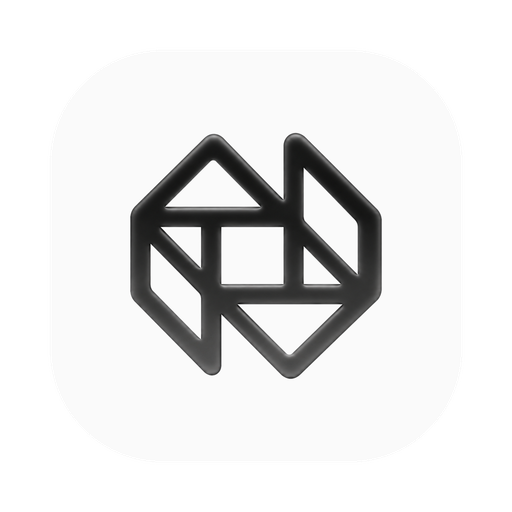
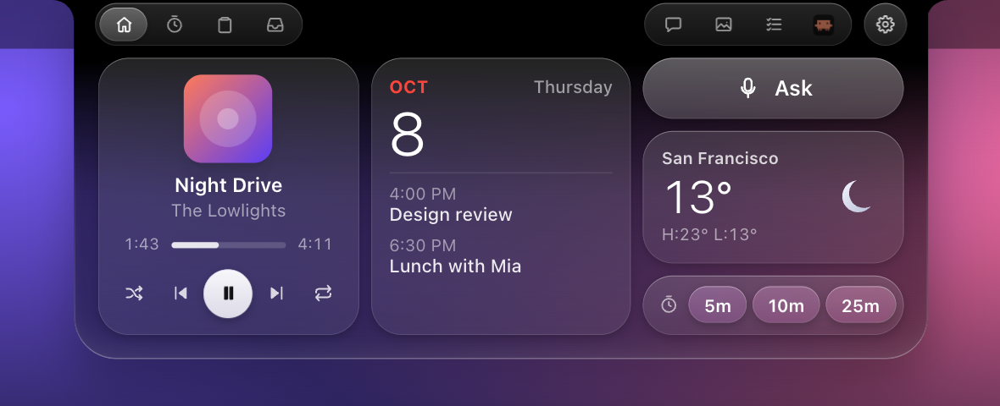
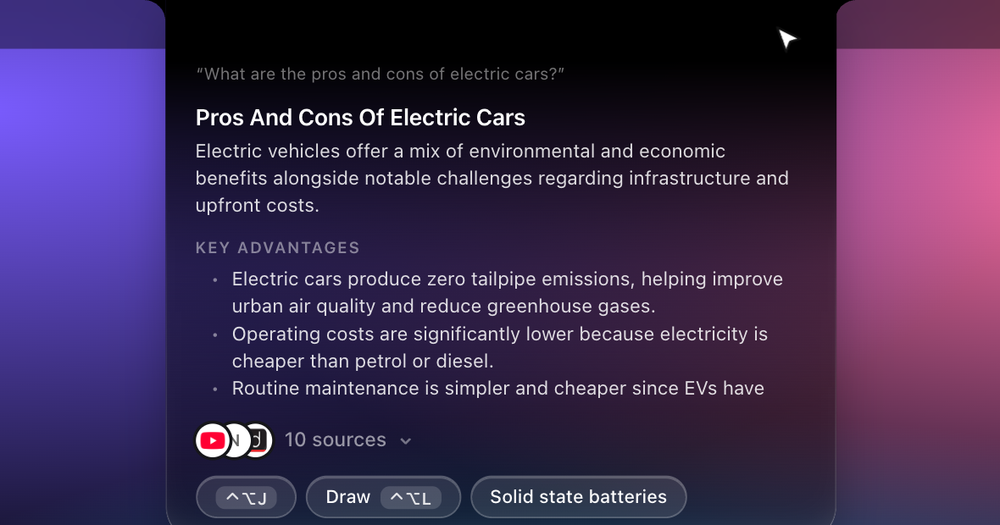
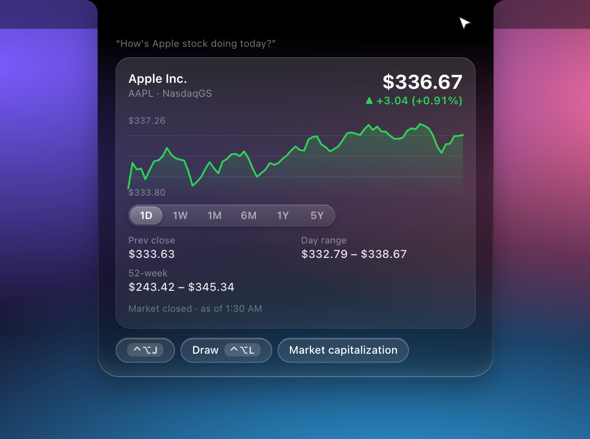
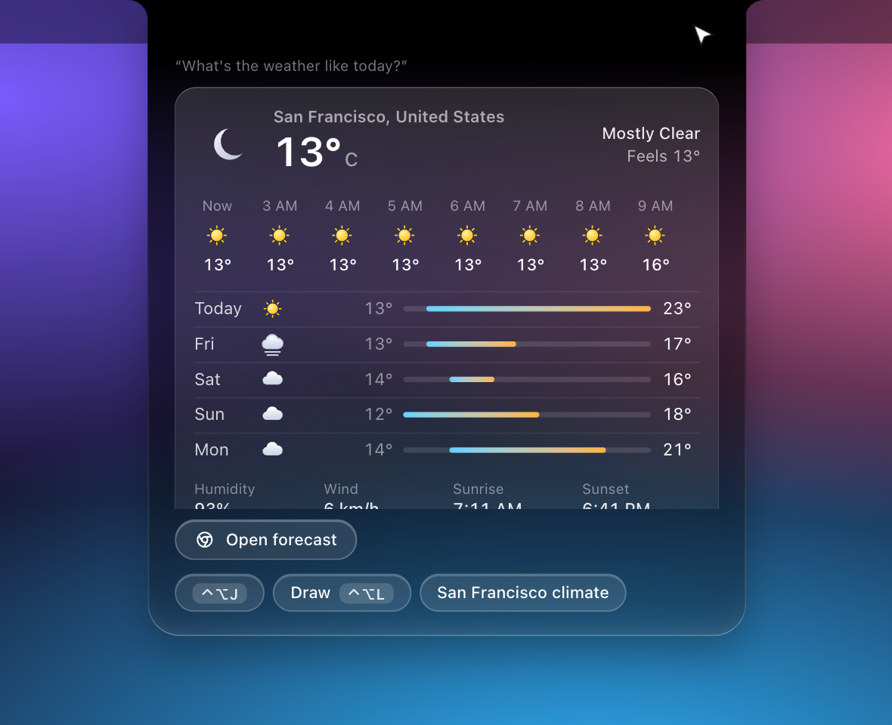

  

<h1 align="center">Focusel</h1>

<b>Your Mac's notch, turned into a voice assistant.</b> 
Press a key, say what you want, and the notch does it: answers, emails, notes, music, meetings and more.

  

---

## What it is

Focusel lives in the notch at the top of your MacBook screen. Most of the time it is a small black bar that shows
what is playing or how long your timer has left. Hover over it and it opens. Press **⌃⌥J**, speak, and it
listens, understands and shows the result right there, without switching apps.

## Shortcuts

| Keys | What happens |
| --- | --- |
| **⌃⌥J** | Start listening. Say anything: a question, a command, a request. |
| **⌃⌥L** | Draw around anything on your screen and ask about it (a photo, a chart, a receipt, an email). |
| **⌥⌘1 … ⌥⌘0** | Paste one of your last copies. |
| **Esc** | Close whatever the notch is showing. |

## A look at the notch

<table>
  <tr>
    <td width="50%"> <b>Listening.</b> Press ⌃⌥J and just talk. It waits until you stop for a few seconds.</td>
    <td width="50%"> <b>At rest.</b> Music and timers show quietly in the notch, one on each side.</td>
  </tr>
</table>

### Ask anything, get one clear answer

Questions come back as a short, sourced answer. A question with several parts is answered once, together.

### The right card for the question

Prices, weather, conversions, maths, times, scores and news each get their own card.

<table>
  <tr>
    <td width="50%"></td>
    <td width="50%"></td>
  </tr>
</table>

---

## What you can do

- **Ask and learn.** Facts, comparisons, news, definitions, sports scores, maths and unit conversions.
- **Get things done.** Set timers, add reminders, write notes, create events, find files, open apps.
- **Write and send.** Draft an email from a few words, attach files from Finder, reply to something you selected.
- **Use your other apps.** Slack, Google Calendar, Drive, Sheets, Meet and more, all by voice.
- **Know what's happening.** Message notifications, incoming calls, music and timers appear in the notch.
- **Hand work to Claude Code.** Say what you want built or fixed and it works on a copy of your project.
- **Translate or explain anything you select.** Select text in any app, press ⌃⌥J and say "translate this to Hindi".

### Make the notch yours

In the app's **Notch** page, pick one of eight layouts for the notch's home page (each fills it completely, mixing small squares, pills, rectangles and large squares), choose which widget goes in each place (now playing, calendar, weather, ask, clipboard, timer), and pick which pages sit in its top bar. The preview is the notch itself, and every change reaches the notch at once.

## Works with your apps

Anything that sends, posts, changes or deletes **shows you a preview first and waits for your click**.

| Category | Apps |
| --- | --- |
| Email | Gmail, Outlook |
| Calendar | Apple Calendar, Google Calendar |
| Notes and documents | Apple Notes, Notion, Google Docs |
| Productivity | Finder, Reminders, Google Sheets, Excel, Google Drive |
| Messaging and meetings | Slack, Microsoft Teams, Google Meet, Zoom |
| Media | YouTube, Spotify, Google Photos |
| Developer | Claude Code, GitHub, Figma |
| Social | LinkedIn, Reddit |
| Maps | Google Maps |

## Built into the notch

| Feature | What it does |
| --- | --- |
| Web answers | Sourced answers and the right card for each kind of question |
| Visual search | Draw around anything on screen and ask about it |
| Timer | Counts down live in the notch |
| Clipboard | Your last 50 copies, one click to copy again |
| File tray | Park a file on the notch and drag it out anywhere |
| Screenshot shelf | Every screenshot and recording lands in the notch |
| Quick notes | A to-do list and scratch notes, one hover away |
| Messages | iMessage and WhatsApp notifications you can read and answer |
| Calls | Phone, FaceTime and meeting calls with mute, video and end |
| Shortcuts | Paste recent copies, and expand short codes like `;em` into your email address |

## Your data stays yours

- **Messages never leave your Mac.** They are read by a small sandboxed helper that has no internet access.
- **Files are shown before they are sent.** Nothing is attached or uploaded without your click.
- **Keys stay on your Mac.** Your API keys are stored only on your computer.
- **Updates are yours to press.** Focusel looks for a newer version on its GitHub releases page every few hours (switch it off in Settings) and only installs when you press Update, and only if the download is signed with the key built into the app. Your settings and keys stay where they are.
- **You can see everything.** The Privacy page lists every request the app makes, and why.
- **Features that read personal data start switched off.**
- **Your location is used only when you switch it on** (Settings → Weather → Use my current location). macOS tells Focusel where this Mac is; only those coordinates go to the weather service (Open-Meteo), and the place's name comes from Apple's own geocoder. It is not stored anywhere else or sent to the AI.
- **Only the app can use its local server.** It refuses other web pages and other programs, and Claude Code tasks run only inside a project folder you choose, with a button to approve any command.

## Download and install

You need a Mac with a notch (Apple silicon) and a free [Gemini API key](https://aistudio.google.com/apikey). For the connected apps (Gmail, Notion, GitHub and more) you can also add a [Composio](https://composio.dev) key, now or later in Settings.

1. **[Download Focusel.dmg](https://github.com/KNMNikhil/Focusel/releases/latest/download/Focusel.dmg)**, open it and drag Focusel into Applications.
2. The first time, macOS may say it can't open the app. Open **System Settings → Privacy & Security**, scroll down and click **Open Anyway**.
3. A short setup walks you through your name, the permissions Focusel needs (each with its reason), and where to get your keys. You can skip any step except the Gemini key and finish it later in Settings.
4. After that, Focusel updates itself: it checks for new releases every few hours and installs only when you press Update (Settings → About).

## About this repository

This repository holds the downloadable releases and this page only. Focusel's source code is not published. Found a bug or have an idea? Open an [issue](https://github.com/KNMNikhil/Focusel/issues).

© Focusel. All rights reserved.

App icons by their creators on [macOSicons.com](https://macosicons.com): GitHub (Dark, Golden Gate) by cannotcollide; Gmail (Dark) by Xcoder; LinkedIn (Alt) by neon.waffle; Figma, Notion and Spotify (iOS 18 Dark) by fizxxr; YouTube (iOS 18/Dark Mode) by crowmium; Notes, Calendar and Reminders (iOS 18 Dark) by kingkwahli. App names and logos belong to their owners.
